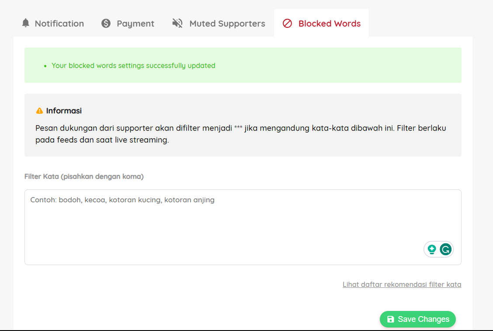
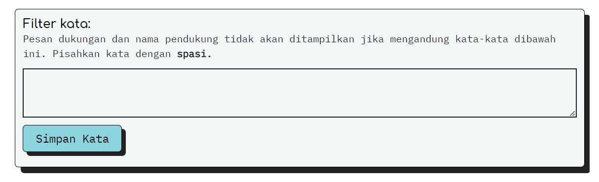

# Generate List of Blacklist Words for Streamer

Goals dari Repo ini adalah menghasilkan **list of words** yang bisa streamer atau konten kreator gunakan untuk filter atau bypass bad words ketika ada yang Donate sewaktu Livestream, `ex: judi, judol, depo, ngewe, etc`.

Untuk sekarang, platform besar yang bisa menerima **filter atau blacklist words** adalah [Trakteer](https://trakteer.id/) dan [Saweria](https://saweria.co/)

Untuk output yang dihasilkan ada dua jenis, yaitu untuk **Trakteer** dan **Saweria**. Karena "rules" yang diberlakukan dari kedua platform tersebut berbeda. Trakteer untuk list of words yang ingin di filter harus dipisah dengan koma (`,`) sedangkan Saweria harus dipisah dengan whitespace (` `)

Alasan lain adalah agar Streamer kesayangan kalian tidak tiba - tiba random gone kena strike atau apapun itu karena ada orang random yang ngedonate ada "bad words" yang kurang enak dilihat.

### Some Technical sh*t

Metode yang digunakan untuk generate bad words cukup simple:
1. Membuat corpus list of words `corpus_bad_words.json`
2. Untuk membuat variasi jenis kata, menggunakan string method seperti `lower`, `upper`, dan `swapcase`. Sebenernya untuk ngeprevent aja kalau ternyata lowercase dan uppercase akan di treat sebagai dua hal yang berbeda

### Insert Blacklist Words to Platform

**Trakteer**
---

1. Buka `Profile > Settings > Blocked Words`
2. Masukkan isi text yang ada di `bad_words_trakteer.txt` ke dalam `"Filter Kata"`
3. Jangan lupa `Save Changes`

**Saweria**
---

1. Buka `Profile > Alert`
2. Setelah itu scroll ke bawah sampai menemukan menu `"Filter kata"`
3. Masukkan isi text yang ada di `bad_words_saweria.txt` ke dalam `"Filter kata"`
4. Jangan lupa `Simpan Kata`

Kalau nggak males, list of bad words nya akan diupdate berkala haha.

Sekian dan Terima Gaji

Tepe